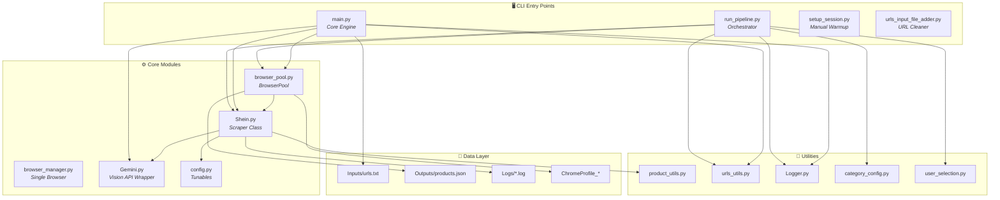
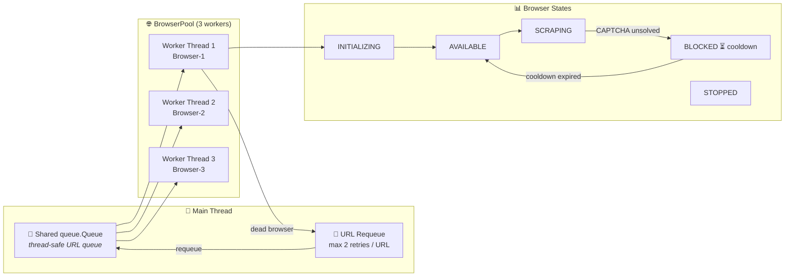
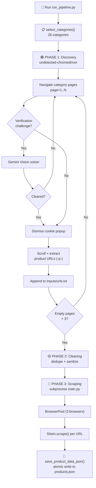
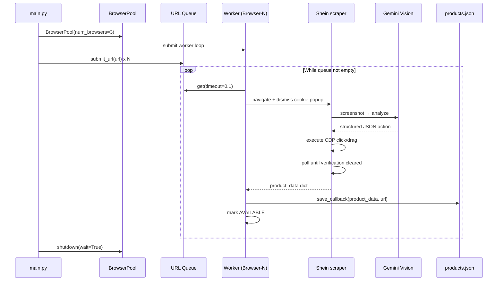
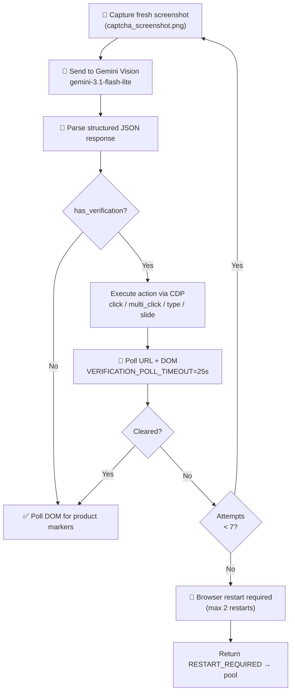

repository implementation.

BLACKBOXAI Thinking...

<p align="center">
  
  
  
  
  
</p>

<h1 align="center">🛍️ SHEIN Web Scraper</h1>

<p align="center">
  <strong>An automated, AI-powered product scraper for SHEIN US</strong><br>
  <em>Anti-detection browsing · Gemini Vision CAPTCHA solving · Concurrent 3-browser pool · Structured JSON output</em>
</p>

<p align="center">
  
  
  
  
</p>


## 📌 Executive Summary

**SHEIN Web Scraper** is a Python-based engineering project that automates the end-to-end collection of product data — names, prices, discounts, descriptions, sizes, SKUs, reviews, and shipping flags — from **SHEIN US** product pages at scale.

The system is built around three pillars:

1. **Realistic browsing** — `undetected-chromedriver` (with Playwright as a fallback) and persistent Chrome profiles avoid bot detection.
2. **AI-powered verification handling** — Google **Gemini Vision** analyzes screenshots and drives CDP mouse events to solve CAPTCHA/verification challenges automatically.
3. **Concurrent, fault-tolerant scraping** — a thread-safe `BrowserPool` runs **3 reusable Chrome instances** in parallel, with automatic CAPTCHA blocking/cooldown, dead-browser recovery, URL requeueing, and incremental JSON persistence.

The project is a complete 3-phase pipeline: **Mass URL Discovery → URL Cleaning → Mass Scraping**, and is designed to scale to **10,000+ product URLs** while protecting results against data loss at every step.


## 🎯 Project Goals

| Goal | How it is achieved |
|------|--------------------|
| Automate product data collection at scale | 3-phase pipeline (Discovery → Cleaning → Scraping) with a concurrent `BrowserPool` |
| Evade bot detection reliably | `undetected-chromedriver` + anti-detection flags + persistent Chrome profiles |
| Solve CAPTCHAs automatically | Gemini Vision AI reads screenshots and returns structured click/drag actions executed via CDP |
| Never lose scraped data | Incremental, atomic writes to `Outputs/products.json` with duplicate-URL detection |
| Handle anti-bot blocking gracefully | Browser status tracking, cooldown, URL requeueing, and automatic browser recreation |
| Provide structured, analyst-friendly output | Unified JSON schema with prices split into integer/decimal parts and structured descriptions |
| Document the engineering decisions | Comprehensive README, module docstrings, and centralized configuration |


## ✨ Project Highlights

> ✅ = Implemented and verified in the repository

- ✅ **AI-powered CAPTCHA solving** — Gemini Vision + CDP mouse events
- ✅ **Concurrent BrowserPool** — 3 reusable Chrome instances running in parallel
- ✅ **Thread-safe architecture** — `threading.Lock`, `queue.Queue`, `ThreadPoolExecutor`
- ✅ **Automatic browser recovery** — dead browsers are detected and recreated
- ✅ **Persistent Chrome profiles** — `ChromeProfile/`, `ChromeProfile_1..3`, `ChromeProfile_Discovery`
- ✅ **Duplicate URL detection** — already-scraped URLs are skipped via `products.json`
- ✅ **Incremental JSON saving** — atomic write (`.tmp` + `os.replace`) after every product
- ✅ **10,000+ product scalable design** — configurable `--target` (default 10,000)
- ✅ **Gemini API key rotation** — multiple `Name:Key` keys with automatic rotation on quota exhaustion
- ✅ **Manual session warmup fallback** — `setup_session.py` for human-assisted CAPTCHA clearing
- ✅ **Dual-channel logging** — colored console output + ANSI-stripped log files


## 📊 Repository Statistics

| Attribute | Value |
|-----------|-------|
| **Language** | Python (>= 3.8) |
| **Architecture** | Multi-threaded (thread pool + shared queue) |
| **Browser Engine** | undetected-chromedriver (Playwright fallback) |
| **AI** | Google Gemini Vision (`google-genai`) |
| **Output Format** | JSON (`Outputs/products.json`) |
| **Target Website** | SHEIN US (`us.shein.com`) |
| **Concurrency** | 3 browsers (default) |
| **CAPTCHA Model** | `gemini-3.1-flash-lite` |
| **Pipeline Phases** | 3 (Discovery → Cleaning → Scraping) |
| **Supported Categories** | 26 main SHEIN categories |


## 🏗️ Project Structure

```text
shein_web_scraper_testing/
├── main.py                   # Core execution engine — orchestrates BrowserPool + saving
├── run_pipeline.py           # End-to-end orchestrator: Discovery → Cleaning → Scraping
├── Shein.py                  # Main scraper class — page loading, parsing, CAPTCHA solving
├── browser_pool.py           # Thread-safe pool of reusable Chrome instances (concurrency)
├── browser_manager.py        # Simple single-browser lifecycle manager
├── Gemini.py                 # Google Gemini API wrapper (Vision CAPTCHA solving)
├── config.py                 # Centralized verification/challenge handling configuration
├── category_config.py        # 26 SHEIN main category names and URLs
├── user_selection.py         # Interactive category selection for the discovery phase
├── setup_session.py          # Manual session warmup (solve CAPTCHAs by hand, save session)
├── product_utils.py          # Filesystem-safe product name normalization
├── urls_utils.py             # URL preprocessing helpers (clean, dedupe, sort, backup)
├── urls_input_file_adder.py  # Standalone URL cleaning/deduplication utility
├── Logger.py                 # Dual-channel logger (terminal + ANSI-stripped log file)
├── requirements.txt          # Python dependencies
├── .env                      # Environment variables (GEMINI_API_KEY) — not committed
├── .gitignore                # Ignored runtime artifacts
├── ChromeProfile/            # Persistent Chrome profile (created at runtime)
├── ChromeProfile_1..3/       # Per-browser profiles used by BrowserPool (runtime)
├── Inputs/
│   ├── urls.txt              # Product URLs to scrape (one per line, # = comment)
│   └── urls-backup.txt       # Automatic backup copy of urls.txt
├── Logs/                     # Dual-channel log files (created at runtime)
└── Outputs/
    ├── products.json         # Accumulated scraped product data (JSON array)
    └── .staging/             # Temporary staging area during runs
```


## 🔧 Technologies Used

| Technology | Purpose |
|------------|---------|
| [undetected-chromedriver](https://github.com/undetected-chromedriver/undetected-chromedriver) 3.5.5 | Anti-detection browser automation |
| [Playwright](https://playwright.dev/python/) 1.51 + `playwright-stealth` | Fallback browser automation engine |
| [Selenium](https://www.selenium.dev/) 4.46 | CDP mouse events & WebDriver control |
| [BeautifulSoup 4](https://www.crummy.com/software/BeautifulSoup/) 4.14 | HTML parsing & product data extraction |
| [google-genai](https://github.com/googleapis/python-genai) 1.61 | Gemini Vision API for CAPTCHA analysis |
| [python-dotenv](https://github.com/theskumar/python-dotenv) 1.2 | `.env` configuration loading |
| [colorama](https://pypi.org/project/colorama/) 0.4 | Colored terminal output |
| [tqdm](https://github.com/tqdm/tqdm) 4.67 | Progress reporting |
| [opencv-python](https://opencv.org/) / [pillow](https://python-pillow.org/) / [PyAutoGUI](https://github.com/asweigart/pyautogui) | Image / screenshot support |
| [requests](https://requests.readthedocs.io/) / [httpx](https://www.python-httpx.org/) | HTTP layer used by the SDKs |


## 📋 Requirements

- **Python** >= 3.8
- **Google Chrome** installed (for `undetected-chromedriver`)
- A **Google Gemini API key** for automated CAPTCHA solving (from [Google AI Studio](https://aistudio.google.com/))

Install all dependencies:

```bash
pip install -r requirements.txt
```


## 🚀 Quick Start

### 1. Configure the `.env` file

Create a `.env` file in the project root with your Gemini API key(s).

**Single key:**

```dotenv
GEMINI_API_KEY=your_gemini_api_key_here
```

**Multiple keys (automatic rotation on quota exhaustion):**

```dotenv
GEMINI_API_KEY=OwnerA:KEY_A,OwnerB:KEY_B,OwnerC:KEY_C
```

> 💡 **Tip:** Legacy plain comma-separated keys are also supported and are auto-named `key_1`, `key_2`, ...

**Optional environment variables:**

| Variable | Description |
|----------|-------------|
| `CHROME_EXECUTABLE_PATH` | Path to a custom Chrome executable |
| `CHROME_PROFILE_PATH` | Path to an existing Chrome profile (for authenticated sessions) |
| `HEADLESS` | Set `true` to run headless (default `false`) |
| `BROWSER_PROXY` | Optional `--proxy-server` value for all browser instances |

### 2. Warm up a Chrome profile (recommended)

The scraper works best with an authenticated Chrome profile. Run the manual session setup once:

```bash
python setup_session.py
```

Solve any CAPTCHAs manually in the opened browser window, then press **ENTER** once the product page loads. The session (cookies) is saved to the `ChromeProfile/` directory and reused by the automated scraper.

### 3. Run the full pipeline

```bash
python run_pipeline.py
```

You will be prompted to select SHEIN categories. The pipeline then:

1. **Phase 1 – Discovery** — navigates category pages, dismisses cookie popups, solves verification challenges with Gemini, and harvests product URLs into `Inputs/urls.txt`.
2. **Phase 2 – Cleaning** — deduplicates and sanitizes the discovered URLs.
3. **Phase 3 – Scraping** — launches `main.py` to scrape every URL with 3 concurrent browsers and save results.


## 🧑‍💻 Usage Reference

### Option A — Full automated pipeline (recommended)

```bash
python run_pipeline.py
```

**Pipeline options:**

| Command | Description |
|---------|-------------|
| `python run_pipeline.py --target 1000` | Stop discovery after 1000 URLs (default 10000) |
| `python run_pipeline.py --out Inputs/urls.txt` | Custom output file for discovered URLs |
| `python run_pipeline.py --categories file.txt` | *Defined in CLI parser; file-loading is currently disabled in code* — categories are chosen interactively |

### Option B — Scrape a fixed list of URLs

1. Put product URLs into `Inputs/urls.txt` (one per line, `#` lines are ignored).
2. Run the core engine:

```bash
python main.py
```

**Main options:**

| Command | Description |
|---------|-------------|
| `python main.py --verbose` | Enable verbose debug output |
| `python main.py --target 10` | Scrape at most 10 URLs (0 = unlimited) |

### Option C — Clean your URL list

```bash
python urls_input_file_adder.py
```


## 🧠 Architecture Overview

The system is split into three cooperating layers:



### BrowserPool Architecture



### Complete Pipeline Flow



### UML Sequence Diagram — Concurrent Scraping




## 🧵 Threading & Concurrency Model

- **1 main thread** submits all URLs into a shared `queue.Queue`.
- **3 worker threads** (via `ThreadPoolExecutor`, `thread_name_prefix="BrowserWorker"`) each own exactly one Chrome instance.
- Browser state (`status`, `blocked_until`, `current_url`) is guarded by a `threading.Lock` (`browser_lock`).
- URL retry counts are guarded by a separate `retries_lock`.
- Processed counters use `_processed_lock` to avoid race conditions.
- Each browser uses its **own profile directory** (`ChromeProfile_1`, `ChromeProfile_2`, `ChromeProfile_3`) to avoid Chrome profile-lock conflicts.
- Browser instances are created **sequentially** at startup (`uc.Chrome` is not thread-safe for creation).

> ⚠️ **Important:** Browser creation is intentionally serialized — `uc.Chrome` cannot be instantiated concurrently.


## 🧠 How It Works — CAPTCHA Solving

### Gemini Vision CAPTCHA Workflow



### Detailed Steps

1. The page is loaded with anti-detection flags (persistent Chrome profile, `--disable-blink-features=AutomationControlled`, etc.).
2. Cookie consent popups are dismissed via aggressive CSS/JS injection (no API call needed).
3. A fresh screenshot is captured and sent to **Gemini Vision**.
4. Gemini returns a **structured JSON** action plan:
   ```json
   {
     "has_verification": true,
     "verification_type": "checkbox",
     "action": "click",
     "target_x": 640,
     "target_y": 380,
     "is_cleared": false
   }
   ```
5. The action is executed via **CDP mouse events** (with `ActionChains` fallback for Selenium).
6. The page is **polled** (`VERIFICATION_POLL_INTERVAL` / `VERIFICATION_POLL_TIMEOUT`) until the URL no longer contains verification patterns and the DOM shows product markers.
7. On repeated failure, the browser is restarted (`BROWSER_RESTART_THRESHOLD`, `MAX_CONSECUTIVE_RESTARTS`), or the URL is requeued / the browser is cooled down.

### Verification Detection Signals

| Signal | Mechanism |
|--------|-----------|
| URL patterns | `captcha`, `challenge`, `verify`, `security-check`, `turnstile` |
| DOM keywords | `"verify you are human"`, `"slide to complete"`, `"i'm not a robot"`, `"turnstile"` |
| Product page markers | `productintro`, `add to bag`, `sku`, `productMainPriceId`, `fsp-element` |


## 📦 Data Extraction Strategy

### Price extraction (3 fallback layers)

1. **JSON-first** — `promotionInfoPrice.amountWithSymbol` and `originalPrice.amountWithSymbol` from embedded `<script type="application/json">`.
2. **HTML selectors** — centralized `HTML_SELECTORS` dictionary in `Shein.py`.
3. **Computational fallback** — old price derived from `current_price / (1 - discount%)`.

Brazilian currency format (`R$2.299,08`) is normalized into separate integer and decimal parts (`("2299", "08")`).
