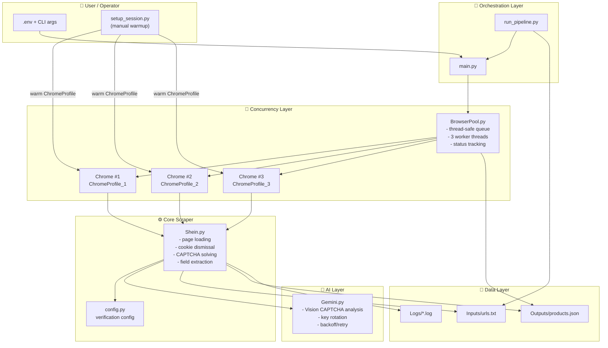
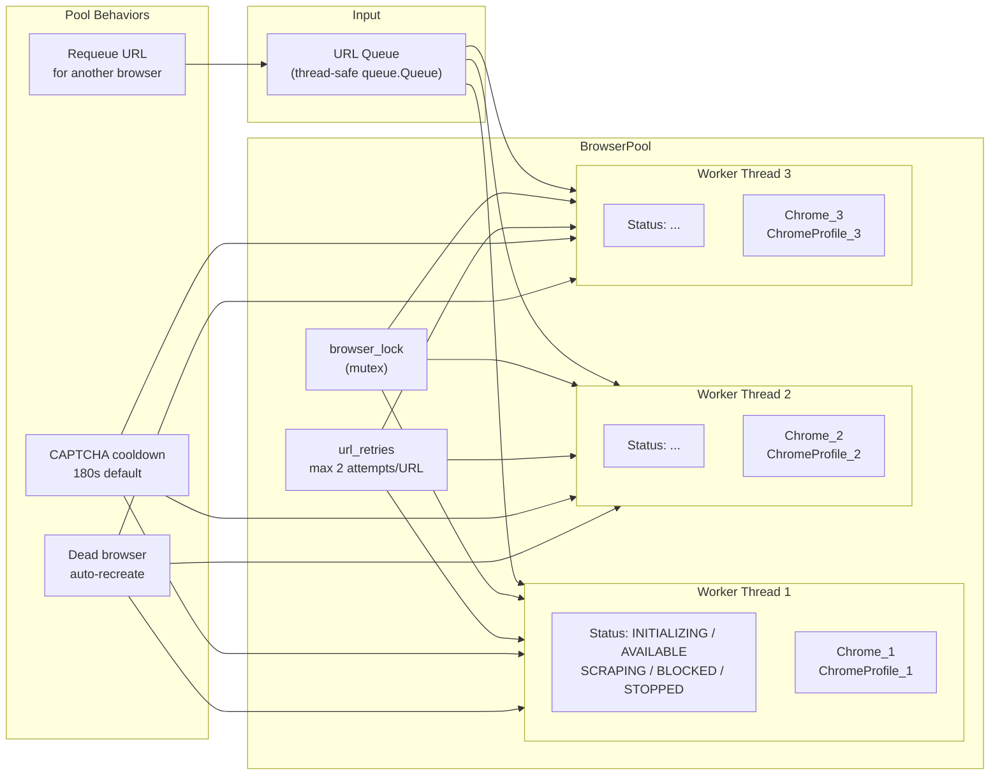
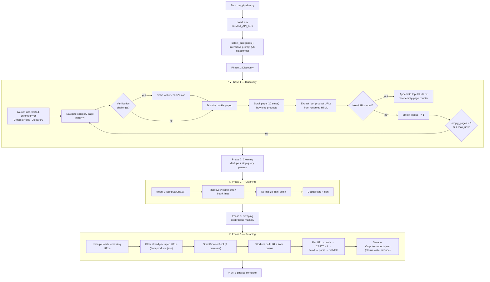

# 🛍️ SHEIN Web Scraper

**AI-powered, concurrent, anti-detection web scraping engine for SHEIN US product data**

---

## 📚 Table of Contents

- [Executive Summary](#-executive-summary)
- [Project Goals](#-project-goals)
- [Key Features](#-key-features)
- [Technologies Used](#-technologies-used)
- [Architecture Overview](#-architecture-overview)
- [Project Structure](#-project-structure)
- [How It Works](#-how-it-works)
  - [System Architecture](#system-architecture)
  - [BrowserPool Architecture](#browserpool-architecture)
  - [Complete Pipeline Flow](#complete-pipeline-flow)
  - [UML Sequence Diagram](#uml-sequence-diagram)
  - [CAPTCHA Solving Workflow](#captcha-solving-workflow)
- [BrowserPool Design & Threading Model](#-browserpool-design--threading-model)
- [Gemini Vision CAPTCHA Workflow](#-gemini-vision-captcha-workflow)
- [Error Handling & Reliability](#-error-handling--reliability)
- [Logging System](#-logging-system)
- [Requirements](#-requirements)
- [Setup & Configuration](#-setup--configuration)
- [Usage](#-usage)
- [Configuration Reference](#-configuration-reference)
- [Supported Categories](#-supported-categories)
- [Output Format](#-output-format)
- [Scaling Strategy for 10,000 Products](#-scaling-strategy-for-10000-products)
- [Performance Optimizations](#-performance-optimizations)
- [Challenges Faced](#-challenges-faced)
- [Assumptions](#-assumptions)
- [Limitations](#-limitations)
- [Future Improvements](#-future-improvements)
- [Troubleshooting](#-troubleshooting)
- [Assignment Deliverables](#-assignment-deliverables)
- [Resources & References](#-resources--references)
- [Ethical & Legal Notice](#-ethical--legal-notice)

---

## ✨ Executive Summary

The **SHEIN Web Scraper** is a production-oriented Python application that automates the collection of structured product data from **SHEIN US** at scale. It combines three layers of defense against bot detection — `undetected-chromedriver`, persistent Chrome profiles, and anti-automation browser flags — with **Google Gemini Vision AI** to automatically detect and solve CAPTCHA/verification challenges.

The system is organized around a **3-phase pipeline**:

1. **Discovery** — mass-harvest product URLs from SHEIN category pages.
2. **Cleaning** — deduplicate and sanitize the harvested URL list.
3. **Scraping** — extract rich product data using a thread-safe pool of **3 concurrent Chrome browsers** with automatic CAPTCHA blocking, cooldown, and URL requeueing.

Every extracted product is saved incrementally to `Outputs/products.json`, preventing data loss on interruption. The design targets high-volume collection (up to **10,000+ product URLs**) while remaining respectful of rate limits and site terms of service.

---

## 🎯 Project Goals

| # | Goal | Implementation |
|---|------|----------------|
| 1 | **Automate end-to-end scraping** | `run_pipeline.py` orchestrates Discovery → Cleaning → Scraping with zero manual intervention. |
| 2 | **Avoid bot detection** | `undetected-chromedriver` + anti-detection flags + persistent Chrome profiles. |
| 3 | **Solve verification challenges automatically** | Gemini Vision AI analyzes screenshots and returns actionable click/type/slide coordinates executed via CDP. |
| 4 | **Scrape concurrently** | `BrowserPool` runs 3 reusable Chrome instances in parallel on a thread-safe queue. |
| 5 | **Extract comprehensive product data** | Name, SKU, prices, discount %, structured description, sizes, reviews, shipping flags. |
| 6 | **Be resilient to failures** | Exponential backoff, key rotation, browser cooldown, URL requeueing, incremental JSON saves. |
| 7 | **Provide visibility** | Dual-channel logging (colored console + ANSI-stripped log files) and live pool status. |

---

## 🧩 Key Features

| Feature | Description | Module |
|---------|-------------|--------|
| 🕶️ **Undetected browsing** | `undetected-chromedriver` with anti-detection flags (`--disable-blink-features=AutomationControlled`, `--no-sandbox`, etc.) and persistent Chrome profiles. | `Shein.py`, `browser_pool.py`, `run_pipeline.py` |
| 🤖 **AI-powered CAPTCHA solving** | Gemini Vision detects checkbox, image-grid, slide-puzzle, and cookie-popup challenges, returning structured JSON actions executed via CDP mouse events. | `Gemini.py`, `Shein.py` |
| 🧵 **Concurrent scraping** | A thread-safe `BrowserPool` manages up to 3 reusable Chrome instances with status tracking, automatic dead-browser recreation, and CAPTCHA cooldowns. | `browser_pool.py` |
| 📦 **Full product extraction** | Product name, SKU, reviews, available sizes, current/old prices, discount %, raw + structured description, international-shipping flags. | `Shein.py` |
| 💱 **Robust price parsing** | Normalizes Brazilian currency (`R$2.299,08` → `2299`/`08`), reads embedded JSON (`promotionInfoPrice` / `originalPrice`), and computes old price from discount when needed. | `Shein.py` |
| 💾 **Incremental JSON saving** | Results are appended to `Outputs/products.json` with duplicate-URL detection and atomic writes (`.tmp` + `os.replace`). | `main.py` |
| 🔁 **3-phase pipeline** | Mass URL discovery from category pages → URL cleaning/deduplication → mass scraping. | `run_pipeline.py` |
| 🔑 **Multi-key rotation** | Supports multiple Gemini API keys (`Name:Key,...`); auto-rotates on quota exhaustion with exponential backoff. | `Gemini.py`, `main.py` |
| 🧑‍💻 **Manual session fallback** | `setup_session.py` lets a human solve CAPTCHAs once and persist the authenticated session for the scraper to reuse. | `setup_session.py` |
| 📝 **Dual-channel logging** | Colored console output mirrored to ANSI-stripped log files in `./Logs/`. | `Logger.py` |

---

## 🛠 Technologies Used

| Technology | Purpose | Version |
|------------|---------|---------|
| [Python](https://www.python.org/) | Core language | ≥ 3.8 |
| [undetected-chromedriver](https://github.com/ultrafunkamsterdam/undetected-chromedriver) | Anti-detection browser automation | 3.5.5 |
| [Selenium](https://www.selenium.dev/) | WebDriver control, CDP mouse events | 4.46.0 |
| [Playwright](https://playwright.dev/) | Fallback browser automation engine | 1.51.0 |
| [BeautifulSoup4](https://www.crummy.com/software/BeautifulSoup/) | HTML parsing & data extraction | 4.14.3 |
| [Google Gemini AI](https://ai.google.dev/) (`google-genai`) | Vision-based CAPTCHA analysis | 1.61.0 |
| [python-dotenv](https://pypi.org/project/python-dotenv/) | `.env` configuration loading | 1.2.1 |
| [colorama](https://pypi.org/project/colorama/) | ANSI terminal colors | 0.4.6 |
| [tqdm](https://pypi.org/project/tqdm/) | Progress reporting | 4.67.3 |
| [Pillow](https://python-pillow.org/) | Screenshot image handling | 12.1.0 |
| [opencv-python](https://pypi.org/project/opencv-python/) | CAPTCHA image support | 4.13.0.92 |
| [PyAutoGUI](https://pyautogui.readthedocs.io/) | Desktop automation / click fallback | 0.9.54 |
| [lxml](https://lxml.de/) | Fast HTML/XML processing | 6.1.1 |
| [requests](https://requests.readthedocs.io/) | HTTP client | 2.32.5 |

> Full pinned dependency list is available in [`requirements.txt`](requirements.txt).

---

## 🏗 Architecture Overview

The scraper is decomposed into **specialized modules** with clear responsibilities:

- **`main.py`** — execution engine: loads `.env`, parses CLI args, filters already-scraped URLs, and drives `BrowserPool`.
- **`run_pipeline.py`** — end-to-end orchestrator that chains the 3 phases and reuses `Shein` verification logic for discovery.
- **`Shein.py`** — the scraper core: page loading, cookie dismissal, CAPTCHA solving, and all product-field extraction.
- **`browser_pool.py`** — concurrent execution: owns N Chrome instances, each running in its own worker thread.
- **`Gemini.py`** — Google Gemini wrapper with retry/backoff, quota-exhaustion detection, and key-rotation signaling.
- **`config.py`** — centralized verification thresholds, keywords, and markers.
- **`category_config.py` + `user_selection.py`** — interactive discovery of the 26 supported SHEIN main categories.
- **Utilities** — `product_utils.py` (safe directory names), `urls_utils.py` (URL preprocessing), `Logger.py` (dual-channel logging), `setup_session.py` (manual warmup), `urls_input_file_adder.py` (URL cleaning).

---

### 🏛 System Architecture

---

### 🧵 BrowserPool Architecture

---

### 🔄 Complete Pipeline Flow

